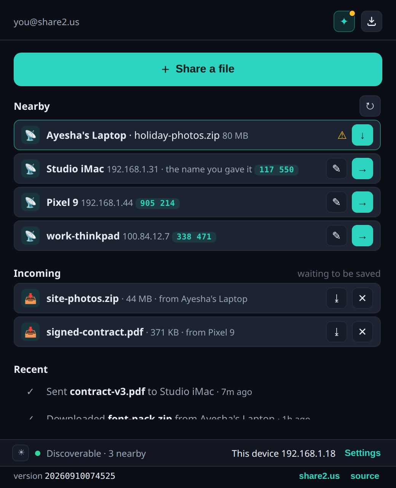
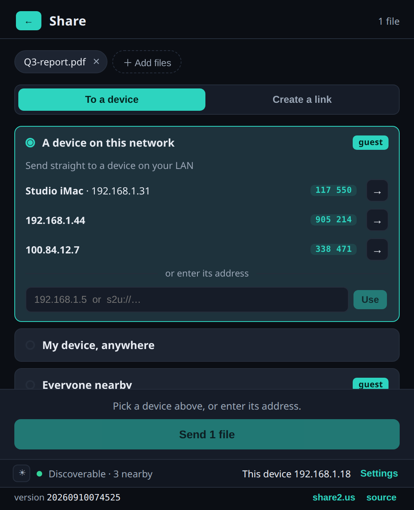
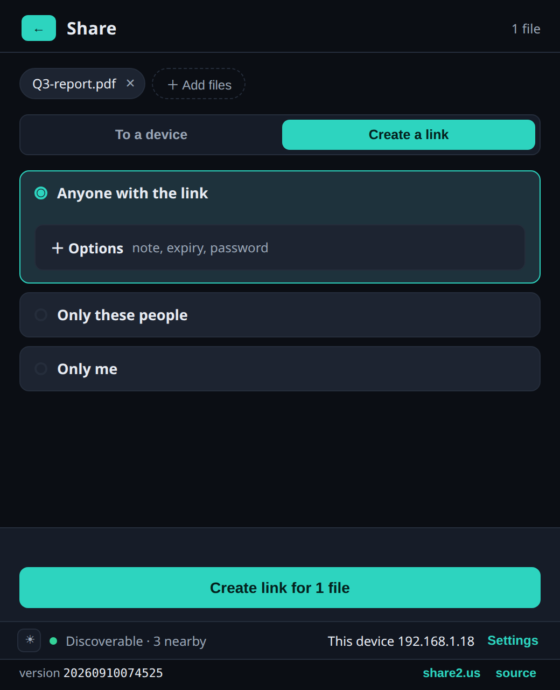

<div align="center">

# Share2Us for the desktop

**Send a file to another machine. Right-click it, pick where it goes, done.**

[**⬇ Download**](https://github.com/share2us/gui/releases) · [Documentation](https://docs.share2.us/desktop/install/) · [share2.us](https://share2.us)

</div>

<table>
<tr>
<td width="33%"></td>
<td width="33%"></td>
<td width="33%"></td>
</tr>
<tr>
<td align="center"><b>See who is nearby</b><br>and what has arrived</td>
<td align="center"><b>Send to a device</b><br>straight across your network</td>
<td align="center"><b>Or make a link</b><br>for anyone, or for no one</td>
</tr>
</table>

## What it does

**Sends a file to another machine on your network.** Nothing is uploaded. The two
machines talk to each other directly, so a large file moves at the speed of your
network rather than your internet connection, and it works with no account and no
internet at all.

**Sends a file to your own machines, or to someone else, from anywhere.**
Encrypted on your machine before it leaves. The server passes along something it
cannot read.

**Makes a link.** For anyone who has it, for named people who have to prove who
they are, or for nobody but you.

Files sent to you wait until you say where they go. They do not appear in
Downloads on their own.

## Install

**Windows.** Open the [releases page](https://github.com/share2us/gui/releases).
The newest release is at the top and starts with a direct link to the installer.
Run it and you are done.

**Linux.**

```sh
curl -fsSL https://raw.githubusercontent.com/share2us/gui/main/scripts/install.sh | sh
```

Then right-click any file and look for **s2u ▸ Share**. On Windows 11 it is under
"Show more options". Sign in from the app the first time, or skip signing in and
use it on your own network.

| | App window | Right-click menu |
| --- | --- | --- |
| Windows | Yes | Yes |
| Linux | Yes | KDE and Nemo, plus "Open With" everywhere |
| macOS | Yes | Not yet |

Re-running the installer updates it, and the app offers an update when one exists.

## Everything else

**[docs.share2.us](https://docs.share2.us)** has the rest: what each option does,
how encryption works, devices and trust, transferring over your own network, and
the command line.

This is the desktop app. There is also a [command-line
client](https://github.com/share2us/cli) that does the same things, and the two
share a library so they behave identically.

## Building it yourself

See [CONTRIBUTING.md](CONTRIBUTING.md) for the architecture, the build, and how to
develop against a local `cli-core`.

## Licence

[GNU General Public License v3.0 only](LICENSE) © 2026 Hassan Khurram. Use it,
study it, share it, change it. If you pass it on, pass on the same freedoms and
make your source available. Building your own copy for yourself carries no
obligation. Dependency licences are in
[THIRD-PARTY-NOTICES.md](THIRD-PARTY-NOTICES.md).
